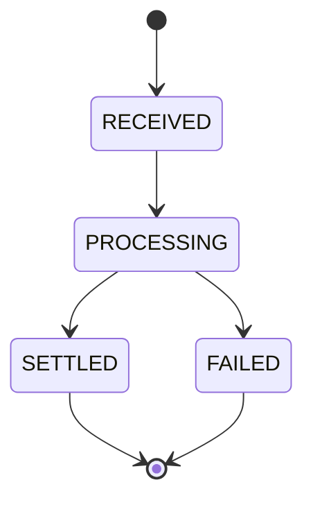

This is **the flagged gap** — the thing most candidates never mention, and the thing that separates someone who's run a real system from someone who's only drawn one.

:::tip[Principal Move]
It's good to volunteer this unprompted at principal level — but for a senior, you should at least design a status and a failure notification the moment you add an async step. **Raise async-failure UX before you're asked.** When you introduce a queue or an async step, proactively say: *"Now I owe the customer a status and a failure notification."* Volunteering this shows you're thinking about the human on the other end, not just the boxes.
:::

## Sync vs async — the hidden cost

- **Sync** = the user **waits** for the result. Simple UX, but tight **coupling** — your latency is their latency, and their request fails if any dependency is down.
- **Async** = you **accept now**, process later. **Resilient** and scalable, but **eventually consistent** — and now you've taken on a UX obligation: the user left without knowing the outcome.

## Status: stable reference + state machine

Every request must return a **stable reference** the user can quote, and a **queryable status** that walks a state machine:

`RECEIVED → … → SETTLED / FAILED`. The reference is stable across retries; the status is always answerable.

## Errors: classify them

Not all failures are equal — tell the user which kind:

- **User-actionable** — "card expired, update it." They can fix it.
- **Transient** — "try again in a moment." It'll likely resolve.
- **Terminal** — "this can't proceed; here's your reference." Final.

:::danger[Never]
**No silent spinner.** A request that fails into a spinner that never resolves is the worst experience — the user doesn't know if their money moved. Every terminal state produces a visible, honest message.
:::

## Notify on failure as loudly as success

:::note[Key Idea]
**Notify on failure as much as on success.** Most systems send a cheerful "Payment successful!" and go silent on failure. The failure message matters *more*: *"You were **not** charged. Reference #ABC123. Here's what to do next."* Silence after a failure is how you lose trust.
:::

## Recovery paths

Make failure recoverable in one move:

- **1-tap retry** — re-submit with the **same idempotency key** so the retry is safe.
- **Auto-reverse** — if a step failed, automatically compensate (refund the hold).
- **Support handoff** — carry the **reference** so support can pick up exactly where it broke.
