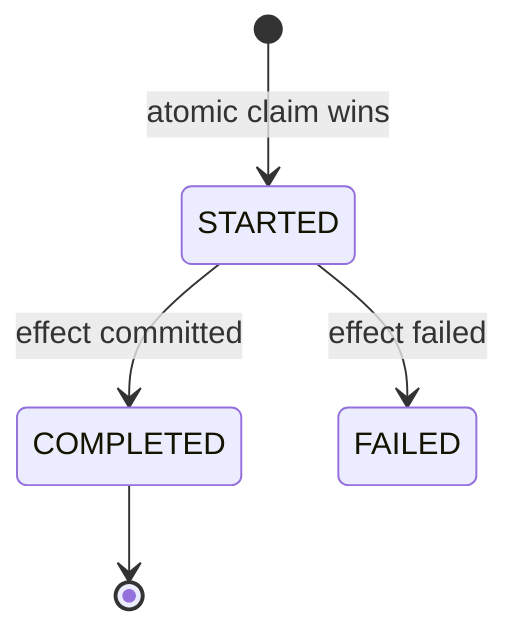

Idempotency is the property that **doing it twice is the same as doing it once**. On an unreliable network where any request may be retried, it's what keeps a single payment from becoming two.

## The key must be client-minted

The idempotency key must be **minted by the client**, **stable across retries**, and **unique per intent**.

:::tip[Principal Move]
It's good to be this precise at principal level — but for a senior, you should at least insist the key is **client-minted and stable across retries**. Get the key source right — it's the most common mistake:

**✓ Good keys** — client-generated UUID, order reference, the provider's own idempotency key.

**✗ Bad keys** — a server-generated ID (different each attempt), an SQS `MessageId`, a request/trace ID, a timestamp. These change on retry, so they don't dedupe the retry.

A `txnId` is fine **only if** it's client-minted and stable across the retry.
:::

## Atomic claim — never check-then-act

The core mechanism is an **atomic claim**: in one indivisible operation, either you win the key or you discover it's taken.

:::danger[Never]
Never **check-then-act** ("does this key exist? no → insert"). Two concurrent retries both read "no", both insert, both process — a double charge. The check and the write must be **atomic**: a unique `INSERT` that fails on conflict, or a conditional put.
:::

## Store the key and the effect in ONE transaction

The idempotency record and the **effect** of the operation must commit in the **same transaction**. Otherwise you can record "done" but crash before the effect, or vice-versa — and lose the guarantee.

## State machine + duplicate handling

Track the key's lifecycle and respond to duplicates by state:

- **`COMPLETED`** + same key → return the **stored result** (true idempotency).
- **`STARTED`** (in-flight) + same key → **409 Conflict** — a duplicate is still processing.
- Same key, **different payload** → **422** — reject; the key was reused for a different intent. **Hash the payload** and compare.

## External effects

The hard case is an effect outside your database — a call to a payment provider. Three tools:

- **Provider idempotency key** — pass your key down so the provider dedupes too.
- **Outbox pattern** — record the intent in your DB transaction, then a relay publishes it; the publish is retriable and deduped downstream.
- **Sink dedup** — the consumer dedupes on a domain ID.

:::note[Key Idea]
Idempotency on the **domain ID**, not the transport ID. A redelivered message from an at-least-once queue carries a *new* `MessageId` but the *same* order reference — key on the order reference. See [Idempotency in Practice](../../deep-dives/idempotency/).
:::
