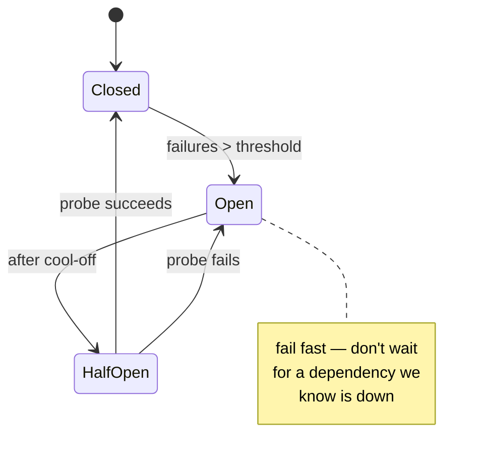

Resilience is a small set of patterns that stop a single failure from becoming a cascade. Interviewers want to hear you compose them.

## Timeout every call

Every network call gets a **timeout**. An unbounded wait is how one slow dependency exhausts your thread pool and takes the whole service down. No exceptions.

## Retry — carefully

:::caution[Trap to avoid]
Retries are a foot-gun. Only retry when **all** of these hold:

- The operation is **idempotent** (or protected by an [idempotency key](../idempotency/)).
- You use **exponential backoff + jitter** (never a tight loop).
- You **cap** the attempts and honour a **retry budget** (cap the % of traffic that is retries).

Naïve retries turn a brief blip into a self-inflicted <abbr title="DDoS — Distributed Denial of Service: overwhelming a service with a flood of requests. 'Self-inflicted' means your own clients' retries cause the flood.">DDoS</abbr>.
:::

### Jitter

**Jitter = randomness added to retry timing.** Without it, every client that failed at the same instant retries at the same instant — a synchronised **retry storm** that hammers the recovering service back down. Jitter spreads them out.

## Circuit breaker

Wraps a dependency and tracks its failure rate:

- **Closed** — calls flow; count failures.
- **Open** — trip; **fail fast** without calling the dependency. Stops the cascade and lets it recover.
- **Half-open** — after a cool-off, let one probe through; promote to closed on success, back to open on failure.

## Bulkhead

Isolate resources into pools/cells so one greedy dependency or noisy tenant **can't sink the whole ship**. Named after a ship's watertight compartments. e.g. a separate connection pool per downstream so one slow dependency can't consume every connection.

## Backpressure & load shedding

When demand exceeds capacity, **protect the critical path**: signal upstream to slow down (backpressure), or **shed** low-priority load (reject early, cheaply) so the important work still completes. Better to drop 5% deliberately than collapse 100%.

:::note[Go deeper · Tech Unpack]
[Why Your System Crashes Under Load — and How Kafka and SQS Push Back →](https://technunpack.substack.com/p/why-your-system-crashes-under-load) — how message queues apply backpressure to protect the critical path.
:::

## Graceful degradation

Design **tiers** of service so you can drop features instead of falling over:

- Serve **stale-but-safe** cached data when the source is down.
- Go **read-only** when writes can't be made safely.
- Disable a non-critical recommendation panel to keep checkout alive.

:::note[Key Idea]
These patterns compose: timeout feeds the circuit breaker's failure count; the breaker enables fail-fast degradation; bulkheads contain the blast radius; backpressure protects what's left. A resilient system is the *combination*, not any one of them.
:::

See the [Reliability Toolkit](../../deep-dives/reliability/) deep dive for how they fit together.
