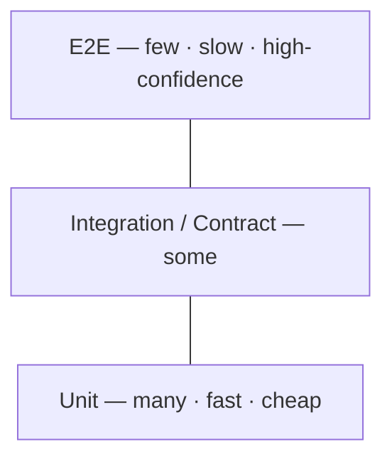

Testing strategy is an architecture decision in disguise — it determines whether teams can deploy independently and whether you trust a green build.

## The pyramid

**Many unit < some integration < few E2E.** Fast cheap tests at the base, a thin layer of slow expensive end-to-end tests at the top.

:::caution[Trap to avoid]
The **ice-cream cone** — the pyramid inverted. Lots of slow, flaky E2E tests and few unit tests. The suite takes an hour, fails randomly, and nobody trusts it, so they stop running it. Invert back to a wide, fast base.
:::

## Contract testing

:::tip[Principal Move]
**Consumer-driven contract testing (Pact)** lets services deploy **independently without a shared staging environment**.

1. The **consumer** records its expectations of the provider as a **contract**.
2. The contract is published to a **broker**.
3. The **provider** verifies it can satisfy every contract before deploy.
4. A **can-I-deploy** gate blocks the deploy if any consumer would break.

No shared end-to-end environment, no integration-testing bottleneck — each team ships on its own cadence. **Message pacts** do the same for queues/events.
:::

## The trade triangle

Every test trades among three properties — you can't max all three:

> **Confidence ↔ Speed ↔ Maintainability**

E2E gives confidence but is slow and brittle; unit tests are fast and maintainable but prove less. Build a portfolio across the triangle rather than betting on one level.

## Bank-grade test types

For a correctness-critical system, add specialised tests:

- **Property tests** — assert invariants over generated inputs, e.g. **`debits == credits`** always holds.
- **Idempotency replay** — replay the same request/event and assert the effect happens once.
- **Reconciliation** — compare your ledger against the external source (the rail/PSP) and alert on drift.
- **Synthetics + canary** — continuously exercise the real production path with test transactions.

:::note[Key Idea]
A green unit suite proves your logic; reconciliation and synthetics prove the *system* still moves money correctly in production. In a bank, you need both kinds of evidence.
:::
