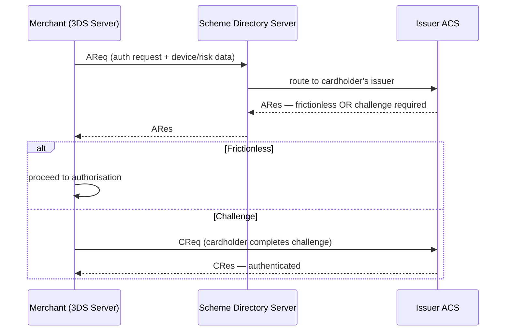

3-D Secure (the "Verified by Visa / Mastercard Identity Check" layer, now **3DS2 / EMV 3DS**) is the step-up authentication for card-not-present payments. Know it as a flow, not a logo.

## The three domains

The "3-D" is **three domains**, each running a server that participates:

- **Merchant domain** — you (the merchant / your PSP), via the **3DS Server**.
- **Scheme / interoperability domain** — the card network's **Directory Server (DS)** that routes between merchant and issuer.
- **Issuer domain** — the cardholder's bank, via its **Access Control Server (ACS)** that makes the auth decision.

## Frictionless vs challenge

:::tip[Principal Move]
3DS2 sends a rich **device + transaction risk** payload up front so most payments are approved **frictionlessly** — no user interaction at all. Only elevated-risk transactions get a **challenge** (OTP, biometric, app approval). The design goal is *security without killing conversion* — every challenge is a checkout you might lose. This is the same step-up idea from the [fraud](../../concepts/security/) layer, applied to cards.
:::

:::note[Go deeper · Tech Unpack]
[How Card Payments Work in Australia →](https://technunpack.substack.com/p/how-card-payments-work-in-australia) — EFTPOS, fees, surcharges, and the 2026 RBA reform behind these card flows.
:::

## Liability shift

The commercial reason 3DS exists:

:::note[Key Idea]
When a transaction is successfully authenticated through 3DS, **fraud-related chargeback liability shifts from the merchant to the issuer.** Without 3DS, the merchant eats fraudulent chargebacks; with it, the issuer does. So 3DS is both a security control *and* a liability-management decision — engineers should know it changes *who pays* when fraud slips through, not just how auth works.
:::

In regulated markets, strong customer authentication (e.g. PSD2 SCA in Europe) effectively **mandates** 3DS for many transactions — so it's a compliance requirement, not just a fraud-reduction nicety.
