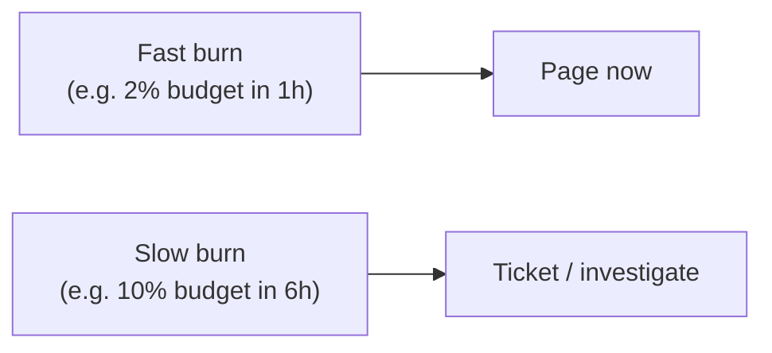

Good alerting wakes a human **only** when a human is needed, with enough context to act. Bad alerting is the leading cause of on-call burnout and missed incidents.

## Alert on symptoms, not causes

:::tip[Principal Move]
Page on what the **user** feels (SLO burn, elevated error rate, latency) — **not** on internal causes (one server's CPU at 90%). A cause may be harmless (autoscaling is handling it); a symptom is always worth knowing. Causes belong on dashboards for *debugging*, not on the pager.
:::

## Burn-rate alerting

The modern approach: alert on **how fast you're burning the error budget**, with **multiple windows** to balance speed against noise.

- **Fast burn** (budget vanishing in hours) → **page** — this is an active incident.
- **Slow burn** (budget eroding over days) → **ticket** — investigate in hours, not at 3am.
- Requiring a **short *and* long window** both firing suppresses flapping (a brief blip clears the short window before the long one trips).

## Datadog

- **Monitors** — metric/anomaly/outlier/forecast monitors; **composite** monitors combine conditions.
- **SLOs** — first-class objects; alert directly on **error-budget burn rate**.
- **APM + Watchdog** — distributed traces and automatic anomaly detection.
- Use **service tags** + low-cardinality dimensions; keep high-cardinality (userId) in traces/logs, never as metric tags — see [cardinality](../../concepts/observability/).

## CloudWatch

- **Alarms** on metrics, with **composite alarms** to combine and suppress noise.
- **Anomaly detection** bands for "normal" ranges instead of static thresholds.
- **Metric filters** turn log patterns into metrics.
- **CloudWatch Synthetics** — canaries that continuously exercise the real production path and alarm on failure.

:::note[Key Idea]
**Every alert is actionable + has a runbook, or it gets deleted.** Tie alerts to **SLO burn**, route by severity (page vs ticket), and review them after every incident — delete the ones that fired uselessly. Alert hygiene *is* reliability work; an ignored pager is worse than no pager.
:::
