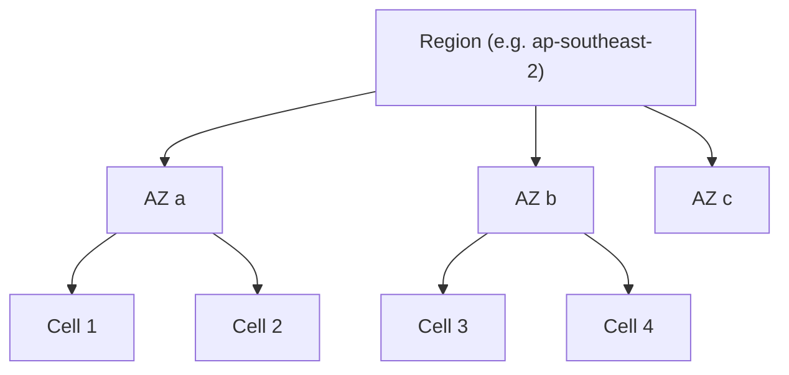

**Blast radius** is how much breaks together when something breaks. Principal-level design is largely about making it small.

## The hierarchy of isolation

- **Region** — a geographic location. Losing one is the **DR** scenario.
- **Availability Zone (AZ)** — an isolated datacenter within a region (independent power/network). Spread across AZs and a single-AZ failure is survivable — the **HA** scenario.
- **Cell** — a complete, independent slice of your stack serving a subset of users/tenants.

## Cell-based architecture

:::tip[Principal Move]
A **cell** is a full vertical slice — its own compute, data, and dependencies — serving a partition of customers. With N cells, any single failure (a bad deploy, a poison tenant, a corrupted cache) is contained to **~1/N of users**.

> Blast radius = **1 cell ≈ −(100/N)%** of the fleet.

Deploys roll **cell by cell**: ship to one cell, watch it, then proceed. A bad release touches one cell, not everyone. This is how the big providers keep a bug from becoming a global outage.
:::

## Shuffle sharding

A refinement that makes isolation even stronger **at almost no extra cost**:

Instead of assigning each tenant to one cell, assign each tenant to a **random pair (or subset) of workers** out of the pool. Two tenants rarely share the *exact same* pair, so one tenant's poison request degrades only the few tenants who happen to overlap — not a whole cell.

> With, say, 8 workers and each customer assigned 2, there are 28 possible pairs. A noisy customer only fully overlaps with customers sharing **both** of their workers — a tiny fraction. Most customers share at most one worker and stay healthy.

:::note[Key Idea]
Isolation is the cheapest reliability you can buy. Regions handle DR, AZs handle HA, cells handle blast radius, and shuffle sharding handles the noisy-neighbour within a cell — each level contains a different class of failure. Name which level contains which failure mode.
:::
