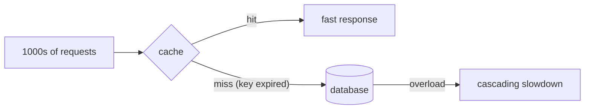

The [Caching](../../concepts/caching/) overview covered the map. Here we go inside the patterns and the failure modes.

## The four patterns, side by side

| Pattern | Read path | Write path | Stampede risk | Best for |
| --- | --- | --- | --- | --- |
| **Cache-aside** | App checks cache → miss → load DB → fill | App writes DB, invalidates key | Yes (on miss) | General-purpose, read-heavy |
| **Read-through** | Cache loads on miss | — | Yes | Same, cache owns fetch logic |
| **Write-through** | From cache | Write cache **and** DB synchronously | Low | Fresh reads right after write |
| **Write-behind** | From cache | Write cache, **async** flush to DB | Low | Write-heavy, tolerates a loss window |

**Stampede fix:** single-flight (coalesce concurrent misses), jittered TTL, negative caching.

## Invalidation strategies

The hardest problem in caching, ordered roughly by freshness vs complexity:

- **TTL** — expire after N seconds. Dead simple, bounded staleness, zero coordination. Default choice.
- **On-write** — update or delete the key when the source changes. Fresh, but you must find every write path.
- **CDC-driven** — subscribe to the database change stream and invalidate from there. Decoupled and reliable — no write path can forget.
- **Versioned key** — embed a version/hash in the key (`user:42:v7`). Old entries are never read and age out naturally. No explicit delete needed.

## The stampede problem in depth

A **cache stampede** (a.k.a. thundering herd / dog-piling):

1. A hot key serves thousands of requests/sec from cache.
2. The key expires.
3. Every in-flight request misses **simultaneously** and stampedes the database.
4. The database buckles; latency spikes; sometimes the cache can't refill because the DB is now overloaded — a feedback loop.

### Fixes

:::tip[Principal Move]
- **Request coalescing / single-flight** — the *first* miss fetches; concurrent misses **wait for that one result** instead of each hitting the DB. One DB query, not a thousand.
- **Jittered TTL** — add randomness to expiry (`TTL ± rand`) so keys populated together don't all expire together. Kills the synchronised stampede the same way jitter kills retry storms.
- **Early/probabilistic refresh** — refresh a hot key slightly *before* it expires, in the background.
- **Negative caching** — cache "not found" briefly so a missing key doesn't stampede the DB on every lookup.
:::

:::danger[Never]
Never serve an authoritative **balance** from cache for a **debit** decision. Cache freshness is best-effort; a debit needs the transactional truth. Read it from the ledger at decision time. (Caching a *display* balance with a clear "as of" timestamp is fine.)
:::
