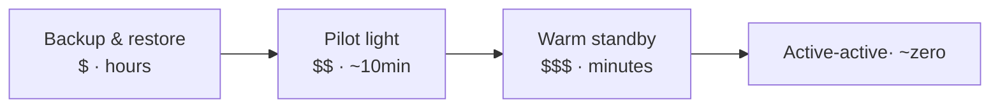

DR is surviving the loss of an entire **region**. The whole design is driven by two numbers and one hard problem (the stateful tier).

## RTO and RPO

- **RTO — Recovery Time Objective** — the maximum **downtime** you'll tolerate before service is restored.
- **RPO — Recovery Point Objective** — the maximum **data loss** you'll tolerate, measured in time.

> A ledger typically demands **RPO = 0** (lose no committed transaction) and a tight **RTO** (minutes). Analytics might happily accept RPO = 24h and RTO = a day. Set them **per data class**, not globally — RPO = 0 everywhere is needlessly expensive.

## The strategy ladder

| Strategy | How | RTO | RPO | Cost |
| --- | --- | --- | --- | --- |
| **Backup & restore** | Periodic backups; rebuild in DR on disaster | Hours+ | Hours | $ |
| **Pilot light** | Core (DB replica) always running; rest spun up on demand | ~10s of min | Low | $$ |
| **Warm standby** | Scaled-down full copy running, scale up on failover | Minutes | Seconds | $$$ |
| **Active-active** | Both regions serve live traffic | ~0 | ~0 | $$$$ |

Climb to your RTO/RPO requirement — and **no further**. Active-active is the gold standard but it's the most expensive and the hardest (you must solve cross-region consistency and conflict resolution).

## The database is the hard part

:::tip[Principal Move]
It's good to reason about cross-region consistency at principal level — but for a senior, you should at least know the **stateful tier is the hard part** of failover, not the compute. Stateless compute fails over trivially — point DNS/Route 53 at the standby region. The **stateful** tier is the whole problem:

- **Async replication** to the standby → fast, cheap, but a small **RPO > 0** (the last few in-flight writes can be lost on sudden failover).
- **Synchronous replication** → **RPO = 0**, but every write now pays the cross-region round-trip in latency, and a standby outage can stall the primary.

For a ledger that needs RPO = 0, you accept the synchronous write cost or use a quorum/consensus store across AZs. Naming this trade — **RPO vs write latency** — is the senior signal.
:::

## Promote on failover, with a human gate

Failover **promotes** the standby database to primary. Automating this is dangerous: a network blip between regions can look like a region loss and trigger a **split-brain** (two primaries accepting writes). Most regulated shops gate the promotion behind a **human decision** for exactly this reason.

:::danger[Never]
**An untested backup/DR plan is hope.** Run **game days** that actually fail over to the standby region and measure the real RTO. The first time you exercise your DR plan must not be during a real disaster.
:::
