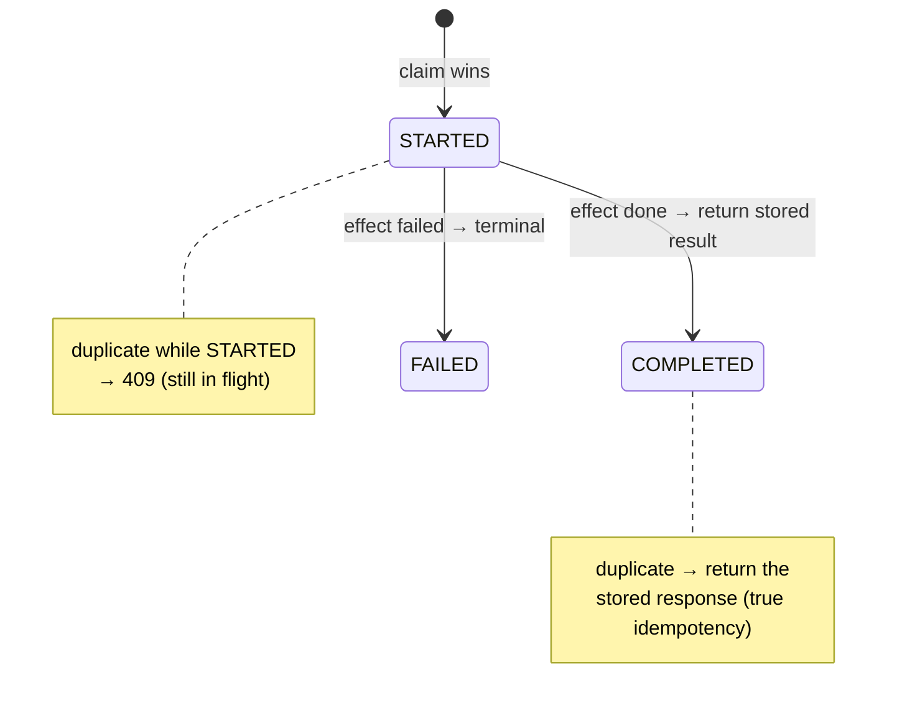

The [Idempotency](../../concepts/idempotency/) page covered the principles. Here's how to actually build it, and the edges that trip people up.

## The atomic claim, concretely

The whole guarantee rests on **claiming the key atomically**. In SQL, that's a unique constraint doing the work:

```sql
-- The claim and the work share ONE transaction.
BEGIN;
  -- Atomic claim: fails if the key already exists.
  INSERT INTO idempotency_keys (key, state, request_hash)
  VALUES ($key, 'STARTED', $hash);          -- UNIQUE(key)

  -- ... perform the effect (e.g. insert ledger entries) ...

  UPDATE idempotency_keys SET state = 'COMPLETED', response = $resp
  WHERE key = $key;
COMMIT;
```

If a concurrent retry runs the same `INSERT`, the unique constraint **rejects it** — there's no window where both proceed. This is why you **never check-then-act**: the check-and-insert must be one atomic step, which a unique index gives you for free.

## Store key + effect in one transaction

The `INSERT` of the key and the **effect** (the ledger writes) commit together. Consider the alternatives:

- Effect first, key second → crash between them → effect applied, but a retry re-applies it (double charge).
- Key first, effect second (separate txns) → crash between them → key says "done" but nothing happened (lost work).

One transaction eliminates both windows.

## Duplicate handling by state



| Incoming duplicate | Stored state | Response |
| --- | --- | --- |
| Same key | `COMPLETED` | Return the **stored response** |
| Same key | `STARTED` (in-flight) | **409 Conflict** |
| Same key, **different body** | any | **422** — key reused for a different intent |

**Hash the payload** on first write; on a duplicate, compare hashes so a reused key with a different body is rejected rather than silently returning the wrong result.

## External side-effects

The DB transaction can't span a call to an external <abbr title="PSP — Payment Service Provider: the external company that actually moves the money, such as a card network, bank, or payment gateway.">PSP</abbr>. Three tools, often combined:

:::tip[Principal Move]
It's good to combine all three at principal level — but for a senior, you should at least pass a **provider idempotency key** so an external call can't double-charge:

- **Provider idempotency key** — pass *your* key to the provider's API. Now the provider dedupes too, so even if you call twice, they charge once.
- **Outbox pattern** — write the *intent to call* into your DB in the same transaction as the state change; a separate relay reads the outbox and makes the call, retrying safely. No dual-write, no lost intent.
- **Sink dedup** — the downstream consumer dedupes on the **domain ID**.
:::

:::note[Key Idea]
Key on the **domain identity**, not the transport. An at-least-once queue redelivers with a fresh `MessageId` but the same `orderRef` — dedupe on `orderRef`. Tying idempotency to `MessageId` means every redelivery looks new and you double-process. This is the single most common idempotency bug.
:::
