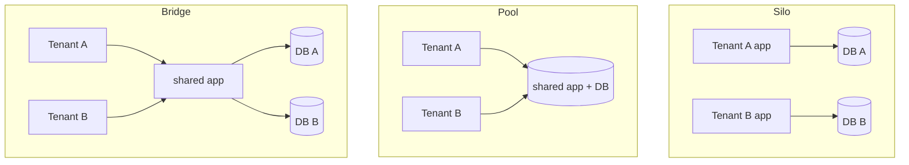

Multi-tenancy is how one system serves many customers. The model you pick trades **isolation** against **cost** and **operability** — and it's a regulatory question in a bank.

## The three models

| Model | Isolation | Cost | Best for |
| --- | --- | --- | --- |
| **Silo** | Highest — dedicated stack per tenant | Highest | Few, large, regulated tenants demanding hard isolation |
| **Pool** | Lowest — shared everything | Lowest | Many small tenants; efficiency-first |
| **Bridge** | Mixed — shared compute, isolated data | Middle | The common pragmatic middle ground |

## Data segregation spectrum

Even within "pooled" compute, the data can be isolated to varying degrees — cheapest to strongest:

1. **Shared schema** — one set of tables, every row tagged with `tenantId`. Cheapest, densest. Relies entirely on the query filter.
2. **Schema-per-tenant** — shared database, separate schema each. Stronger boundary, more overhead.
3. **Database-per-tenant** — full data isolation; approaches the silo model.

## Enforce the boundary

:::danger[Never]
Never rely on the application *remembering* to add `WHERE tenant_id = ?`. One forgotten filter is a **cross-tenant data leak** — catastrophic in a bank. Enforce it **below** the app:

- **Row-Level Security (RLS)** in Postgres so the database itself rejects cross-tenant reads.
- **`tenantId` threaded everywhere** — request context → query → cache key → log.
- **Per-tenant encryption keys** for the strongest isolation, so even a leaked row is unreadable.
:::

## The noisy-neighbour problem

:::tip[Principal Move]
In a **pool**, one tenant's spike can starve everyone — the **noisy neighbour**. Contain it with **per-tenant rate limits and quotas**, **bulkheads** (isolated resource pools), and **[shuffle sharding](../blast-radius/)** so a heavy tenant degrades only the few it overlaps with, not the whole pool.
:::

:::note[Key Idea]
Start as pooled as your isolation/regulatory requirements allow (cheapest, densest), and **promote specific tenants to stronger isolation** (schema → DB → silo) as they grow or demand it. Don't silo everyone by default — you'll pay for isolation nobody needed.
:::
