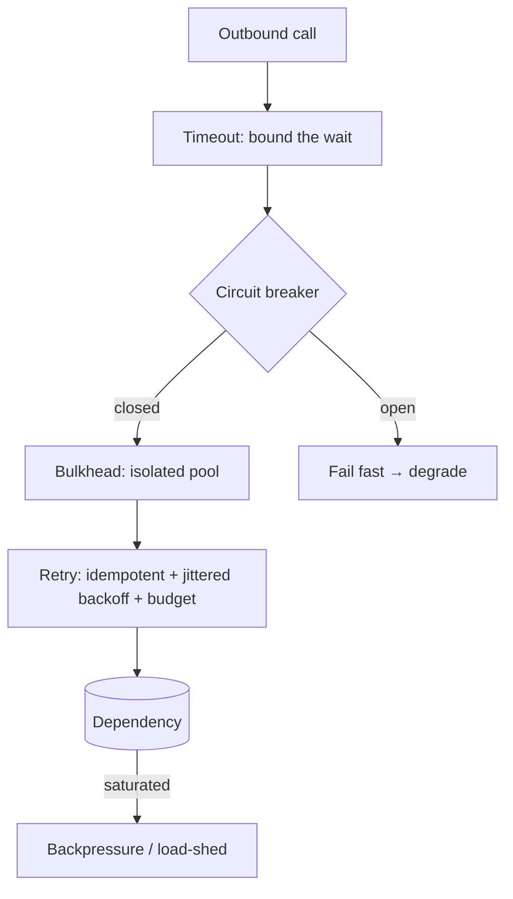

The [Resilience Patterns](../../concepts/resilience/) page introduced each tool. The principal skill is **composing** them so one failure can't cascade.

## How they compose

Each tool feeds the next:

1. **Timeout** bounds every call — and *generates* the failure signal the breaker counts.
2. **Circuit breaker** aggregates those failures and, when tripped, **fails fast** instead of piling onto a dying dependency.
3. **Bulkhead** ensures the failures are contained to one pool/cell — the rest of the system keeps its resources.
4. **Retry** (only for idempotent ops, with jittered backoff + a budget) recovers from *transient* blips without amplifying a real outage.
5. **Backpressure / load-shed** protects the critical path when demand exceeds capacity.
6. **Graceful degradation** is the user-visible result: stale-but-safe, read-only, or a reduced feature set.

## The retry-storm anti-pattern

:::caution[Trap to avoid]
Retries without a **budget** and **jitter** are how a 30-second blip becomes a 30-minute outage:

- A dependency hiccups; thousands of callers fail at once.
- They all retry — **at the same time** (no jitter) — tripling the load on the recovering dependency.
- It falls over again; they retry again. Self-sustaining.

The fix is the trio: **idempotent** (so retrying is safe) + **exponential backoff with jitter** (so they don't synchronise) + **retry budget** (cap retries to e.g. 10% of traffic).
:::

## Why fail-fast beats waiting

A circuit breaker's value is counter-intuitive: **failing fast is kinder than trying.** When a dependency is down, every request that *waits* for its timeout holds a thread/connection hostage. Enough of them and your service exhausts its pool and dies too — the dependency's outage becomes yours. The open breaker returns an error in microseconds, freeing resources to serve the requests that *can* succeed.

:::note[Key Idea]
Resilience is an emergent property of the **combination**. Any one pattern alone leaves a gap: timeouts without breakers still exhaust pools under sustained failure; breakers without bulkheads still let one tenant trip everyone's breaker. Name which patterns you're composing and what each one contains.
:::
