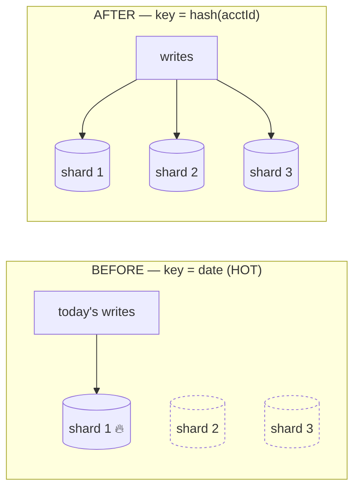

Sharding scales **writes** by splitting data across nodes. It's powerful and hard to undo — so the **shard key** is the decision that matters most.

## Choosing a shard key

The shard key determines which node owns a row. A good key:

- **Spreads load evenly** — no single node gets disproportionate traffic.
- **Keeps related data together** — so common queries hit one shard, not all of them.
- **Has high cardinality** — many distinct values to spread across.

## The hot-shard problem

:::caution[Trap to avoid]
A **range-based** or **time-based** key concentrates today's traffic on one shard.

If you shard by date, **all of today's writes** land on the shard owning today — that one node is on fire while the others idle. Tomorrow the hotspot just moves to the next shard.

**Fix:** shard by a **hash** of a high-cardinality attribute (e.g. `hash(accountId)`) so writes spread uniformly across all shards.
:::

:::note[Go deeper · Tech Unpack]
[The Database Performance Bottlenecks →](https://technunpack.substack.com/p/the-database-performance-bottlenecks) — how partitioning and indexes shape real database performance.
:::

## Cross-shard operations are the tax

The cost you take on when you shard:

- **Cross-shard joins** — data that needs joining now lives on different nodes. You scatter-gather (query all shards, merge) or denormalise.
- **Cross-shard transactions** — an atomic write spanning shards needs a distributed transaction (slow, or a [saga](../../concepts/consistency/)). Avoid by co-locating data that changes together under one key.
- **Rebalancing** — adding a shard means moving data. **Consistent hashing** minimises how much moves.

:::tip[Principal Move]
Climb the ladder — don't start here. **Read replicas** first (scale reads), then shard **only when write throughput nears the primary's ceiling**, and choose the key so your hottest queries stay **single-shard**. Sharding prematurely buys you cross-shard pain before you've earned the scale that justifies it.
:::

:::note[Key Idea]
The shard key is effectively permanent — re-sharding a live system is one of the most painful migrations there is. Spend your design time here: model the access pattern, then pick the key that keeps the common path on one shard.
:::
