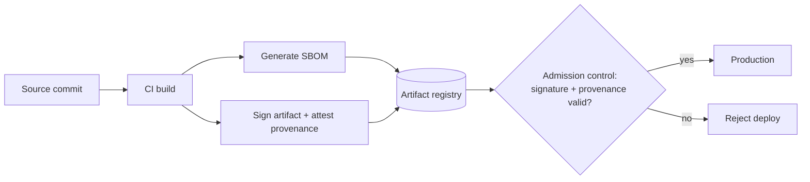

The 2020s taught everyone that your biggest risk may be code you didn't write — a dependency, a build tool, a base image. Supply-chain security is about **proving** what's in production and trusting how it got there.

## SBOM — Software Bill of Materials

An **SBOM** is a complete manifest of every component and version in a build — direct and transitive dependencies, libraries, base-image packages.

:::tip[Principal Move]
It's good to operationalise this fully at principal level — but for a senior, you should at least keep an **SBOM** so you can answer "are we affected?" fast. The SBOM answers one question: **"When the next Log4Shell drops, are we affected, and where?"** Without an SBOM you're grepping repos for days during an active exploit. With one, you query the manifest and have an answer in minutes. Generate it **at build time** (CycloneDX / SPDX format) and store it per release.
:::

## Signed artifacts & provenance

- **Sign** every build artifact (e.g. Sigstore/cosign) so production only runs images whose signature verifies — an attacker can't slip in an unsigned image.
- **Provenance / attestation** (SLSA framework) records *how* an artifact was built — which source commit, which builder, which steps — so you can prove it came from your trusted pipeline and wasn't tampered with.

## DAST and the scanning suite

Where the other scanners (SAST on source, SCA on dependencies) shift left, **DAST** tests the **running** application from the outside — exercising real endpoints to find injection, auth, and config flaws that only appear at runtime. Run it against a staging deploy in the pipeline, gating release on the results. Pair with **secret scanning** and **IaC scanning** so leaked credentials and misconfigured infrastructure never reach prod.

## Prove what's in prod

:::note[Key Idea]
**SBOM + signed artifacts + provenance = "prove what's in production and how it got there."** Combine with **GitOps** (the desired state is a signed, reviewed git commit), **separation of duties** (the person who writes ≠ the person who approves the deploy), and an **immutable audit trail**. In a regulated shop this isn't optional — an auditor can ask "what exactly is running and who approved it?" and you must answer with evidence, not memory.
:::
