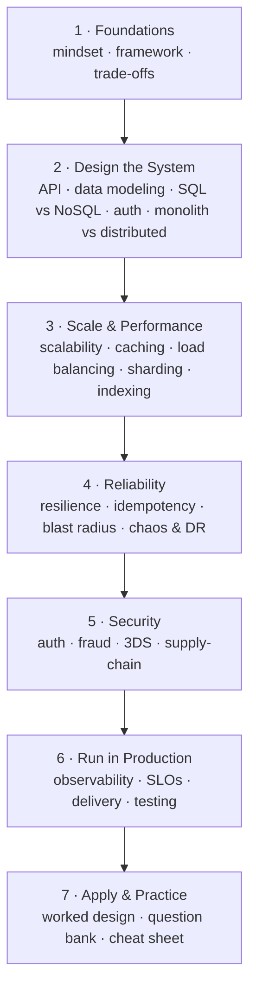

import { Card, CardGrid } from '@astrojs/starlight/components';

## How to use this manual

Read it **in order** like a course, or jump to any topic to refresh. The chapters follow how you actually build a system — **design it → scale it → make it reliable → secure it → operate it → apply it.** Each part builds on the one before, so the knowledge stacks up instead of sitting in a pile.

<CardGrid>
	<Card title="1 · Foundations" icon="rocket">
		How to approach the room — the mindset, the step-by-step interview
		framework, and the trade-off axes you'll return to in every answer.
		[Start →](/system-design-interview/start/mindset/)
	</Card>
	<Card title="2 · Design the System" icon="pencil">
		The "what to build" phase — API design, data modeling, choosing a
		database, authentication, and monolith vs distributed.
		[Design →](/system-design-interview/design/api-data-modeling/)
	</Card>
	<Card title="3 · Scale & Performance" icon="rocket">
		Make it fast and big — scalability, caching, load balancing, database
		sharding, and indexing & query optimization.
		[Scale →](/system-design-interview/concepts/scalability/)
	</Card>
	<Card title="4 · Reliability" icon="approve-check">
		Survive failure — resilience patterns, idempotency, blast-radius
		containment, multi-tenancy, and disaster recovery.
		[Harden →](/system-design-interview/concepts/resilience/)
	</Card>
	<Card title="5 · Security" icon="warning">
		Protect it — the security surface, fraud, 3D Secure, and supply-chain
		integrity.
		[Secure →](/system-design-interview/concepts/security/)
	</Card>
	<Card title="6 · Run in Production" icon="setting">
		Operate it — observability, SLI/SLO/SLA & error budgets, alerting,
		DevSecOps delivery, and testing.
		[Operate →](/system-design-interview/concepts/observability/)
	</Card>
	<Card title="7 · Apply & Practice" icon="open-book">
		Tie it together — a bank-grade worked design with diagrams, plus a
		question bank and a cheat sheet to memorise.
		[Practice →](/system-design-interview/worked-design/money-movement/)
	</Card>
</CardGrid>

## The one habit that matters most

Before reaching for any technology, say it out loud: **the choice → the alternative rejected → the trade-off accepted → the failure mode at 10×.** Name the property you need first, then the tech. That single habit — covered in [The Mindset](/system-design-interview/start/mindset/) — is what separates a senior answer from a junior one.
