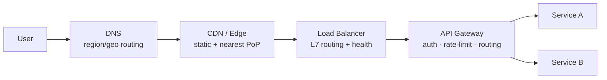

The moment you run **more than one** server (which is how you scale horizontally), something has to decide *which* server each request goes to. That's load balancing — and it's also what gives you failover when a server dies.

:::note[Go deeper · Tech Unpack]
[Horizontal Scaling — Load Balancers, Sticky Sessions, and What "Stateless" Actually Requires →](https://technunpack.substack.com/p/horizontal-scaling-load-balancers) — a hands-on walkthrough of the exact mechanics on this page.
:::

## Why you need it

- **Spread load** evenly so no single server is overwhelmed.
- **Enable horizontal scaling** — add servers behind the balancer and they just start taking traffic.
- **Failover** — the balancer stops sending traffic to a server that fails its health check.
- **Zero-downtime deploys** — drain a server, deploy, return it to the pool.

## L4 vs L7 — two levels

A load balancer can work at two layers of the network:

| | **L4 (transport)** | **L7 (application)** |
| --- | --- | --- |
| Sees | IPs and ports (TCP/UDP) | The actual HTTP request (path, headers, cookies) |
| Can route on | Connection only | URL, host, header — *"`/api` → service A, `/img` → service B"* |
| Speed | Faster, dumber | Slightly slower, much smarter |
| Use for | Raw throughput, any protocol | HTTP apps, content-based routing |

**Rule of thumb:** L7 for web/API traffic (you usually want path/host routing); L4 when you need raw speed or non-HTTP protocols.

## Balancing algorithms

How the balancer picks the target:

- **Round-robin** — next server in turn. Simple; assumes all requests are equal.
- **Least connections** — the server with the fewest active connections. Better when request durations vary.
- **Consistent hashing** — the same key (e.g. userId) always maps to the same server. Essential for **sticky** caches/sessions and for minimizing reshuffling when servers are added/removed. → [Sharding](../../deep-dives/sharding/)

## Health checks & draining

This is what turns a load balancer into a **reliability** tool:

- **Health checks** — the balancer pings each server (`GET /health`); a server that fails is pulled from the pool automatically. → [Resilience](../../concepts/resilience/)
- **Connection draining** — before taking a server down, stop sending it *new* requests but let in-flight ones finish. This is how you deploy without dropping requests.

:::tip[Principal Move]
It's good to speak from fleet experience at principal level — but for a senior, you should at least pair **health checks with connection draining**. Adding servers only helps if a dead one is removed automatically and a deploying one is drained gracefully. Mention both — it shows you've operated a fleet, not just drawn one.
:::

## The routing layers (edge → server)

A request passes through several routing hops before it hits your code. Know the chain:

- **DNS** — first hop; can route users to the **nearest region** (geo/latency-based).
- **CDN / edge** — serves static assets from the **nearest** point of presence; only dynamic requests go further. → [Caching](../../concepts/caching/)
- **Load balancer** — spreads across healthy servers in the region.
- **API gateway** — one front door for auth, rate-limiting, and routing to the right service. → [Auth](../../design/auth/)

:::note[Key Idea]
Requests don't go straight to a server — they flow **DNS → CDN → load balancer → API gateway → service**, each layer adding routing, caching, or protection. Statelessness is what makes this work: any server can handle any request, so the balancer is free to send it anywhere. → [Scalability](../../concepts/scalability/)
:::
