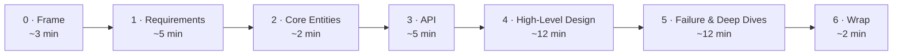

A repeatable structure keeps you from freezing or running out of time. You always know what to produce next, and you spend your minutes where they're scored. This is our playbook — each step below is **what to do** plus a worked **example**, with a **bank-grade, failure-first** bias baked in.



For *how to behave* while you do this — driving the conversation, naming every choice as **decision → rejected alternative → trade-off → failure mode** — see [The Principal Mindset](../mindset/). This page is the *what to produce*.

## 0 · Frame it (~3 min)

Align on the problem before drawing anything.

**Do this:**

- **Restate the prompt** in one sentence and get agreement.
- **Ask 2–3 clarifying questions** that change the design (who are the users? what scale? what's the one thing that must not break?).
- **Write your assumptions on the board** — throughput, latency budget, durability, consistency, scale — so everyone designs against the same target.
- **Declare the [bank lens](../mindset/)** you'll carry: under doubt, *refuse* rather than serve a possibly-wrong answer.

**Example — assumptions on the board:**

> *~5k TPS peak · p99 < 300 ms on the sync path · RPO = 0 for the ledger · multi-tenant, regulated.*

## 1 · Requirements (~5 min)

### Functional — "users should be able to…"

**Do this:**

- Write **2–3 concrete user actions** — verbs, not features.
- **Confirm** them with the interviewer as the flows you'll design for.
- **Park everything else** out loud as nice-to-have / out of scope.

**Example:**

- ✅ *"A user can send money to another user."*
- ✅ *"A user can view their transaction history."*
- 🅿️ Deferred: notifications, spending limits, statements export → "out of scope for today."

:::caution[Trap to avoid]
**List only the ~3 core features.** You're scored on spotting the *handful that define the system* and designing those well — not on how many you can name. A long, unfocused list signals you can't prioritise and spreads your remaining ~40 minutes too thin to design anything properly. Scoping down is the senior move, not a shortcut.
:::

### Non-functional — "the system should…"

**Do this:**

- **Quantify** each one — *"low latency"* is meaningless; *"feed < 200 ms at p99"* is a target.
- **Pick the 3–5 that drive the design** from this checklist:

| NFR | Ask yourself | Goes deeper |
| --- | --- | --- |
| **CAP** | Consistency or availability under partition? | [Consistency](../../concepts/consistency/) |
| **Scalability** | Bursty traffic? read/write ratio? | [Scalability](../../concepts/scalability/) |
| **Latency** | How fast, especially compute-heavy paths? | — |
| **Durability** | How bad is data loss? (Ledger: none.) | — |
| **Security & compliance** | Access control, PCI/APRA? | [Security](../../concepts/security/) · [AU 2026](../../australia-2026/context/) |
| **Fault tolerance** | Redundancy, failover, recovery? | [Resilience](../../concepts/resilience/) |
| **Environment** | Mobile battery, limited memory/bandwidth? | — |

**Example:** *"<abbr title="Consistency + Partition-tolerance (CAP). Under a network partition the system favours correctness over staying available — it rejects writes it can't confirm rather than risk divergent data.">CP</abbr> on the money path (correctness > availability), <abbr title="99th-percentile latency — 99% of requests finish faster than this. It describes the slow-tail experience, not the average.">p99</abbr> &lt; 300 ms, <abbr title="Recovery Point Objective — the maximum data loss you can tolerate, measured in time. RPO = 0 means lose zero committed transactions, even in a disaster.">RPO</abbr> = 0, survive an <abbr title="Availability Zone — an isolated datacenter within a cloud region. 'Survive an AZ loss' means staying up even if one whole zone fails.">AZ</abbr> loss."*

### Capacity — only if it changes a decision

:::tip[Principal Move]
**Do the arithmetic only when a number flips a choice.** Skip back-of-envelope math that just concludes *"it's a lot."*

- ❌ Computing total storage just to say "that's big." → tells the interviewer nothing.
- ✅ Estimating Top-K cardinality to decide **single-node min-heap vs sharded**. → changes the design.

Otherwise: "I'll estimate when a number informs a choice," and move on.
:::

## 2 · Core Entities (~2 min)

The nouns your API exchanges and your system persists — the data-model foundation.

**Do this:**

- **List the nouns** as a first draft (don't model columns yet).
- **Keep it small** — let it grow as the design reveals what state each request mutates.
- **Use prompts:** *Who are the actors? What resources satisfy the functional requirements?*

**Example — a payments system:**

- `User` — an account holder.
- `Account` — a balance the money moves between.
- `Payment` — one money-movement request, with a status.
- `LedgerEntry` — the immutable debit/credit record.

*(Fields come later — in the high-level design, when you see which request touches which entity.)*

## 3 · API / Interface (~5 min)

The contract between your system and its users — define it before internals; it maps closely to the functional requirements and guides the design.

**Do this:**

- **Pick a protocol** (don't overthink it):
  - **REST** — default for most interviews.
  - **GraphQL** — diverse clients, avoid over-/under-fetching.
  - **gRPC** — internal, performance-critical service-to-service.
- **One endpoint per functional requirement** — this becomes your design checklist in step 4.
- **Add real-time transport** (WebSockets / SSE) only if a flow needs it — design the core API first.

**Example:**

```text
POST /v1/payments         body: { "amount": ..., "dest": ... }   (Idempotency-Key header)
GET  /v1/payments/{id}  → Payment
GET  /v1/statement      → Entry[]
```

:::danger[Never]
**Derive the caller's identity from the auth token — never from the request body or path.** Trusting a `userId` from user input lets anyone act as anyone. Resources are plural nouns (`/payments`, not `/payment`). → [Security](../../concepts/security/)
:::

**Data-flow systems (ETL, pipelines):** instead of an API, sketch the processing sequence — *ingest → validate → transform → store → index.*

## 4 · High-Level Design (~12 min)

Boxes and arrows that satisfy the **API you just defined**.

**Do this:**

- **Go endpoint by endpoint** — add just enough components (services, datastores, caches, queues) to serve each one.
- **Narrate the data flow** out loud — what state changes on each request, start to response.
- **Jot only design-relevant fields** next to each datastore (not every column).

**Example — `POST /v1/payments`:**

> Client → API Gateway (auth, rate-limit) → Payment service → writes a `Payment(status=PENDING)` and a double-entry to the **Ledger (Postgres)** in one transaction → returns `202` with the payment id.

:::caution[Trap to avoid]
**Don't gold-plate.** The most common failure is layering complexity too early and never reaching a complete solution. Build the simplest design that meets the **functional** requirements; defer caches, queues, and sharding to the deep dives where you harden against the **non-functional** ones. Spot a complexity opportunity? One-line verbal callout, then move on.
:::

## 5 · Failure modes & deep dives (~12 min)

Where senior candidates separate themselves — **lead this, don't wait to be probed.** Work two tracks:

**Track A — failure-first (our bias).** For each risky component, walk the failure:

- It **times out** (unknown outcome) → reconcile, don't assume failed.
- It **dies mid-operation** → durable state + idempotent resume.
- A **partition** splits → CP refuse vs AP degrade.
- At **1× vs 100×** → what breaks first, what's the next move?

**Track B — harden the NFRs.** Meet each non-functional requirement, address edge cases, fix bottlenecks. → [Resilience](../../concepts/resilience/) · [Load Shedding & Bottlenecks](../../deep-dives/load-shedding/) · [Idempotency](../../concepts/idempotency/)

**Example:** *"The PSP call times out — I don't know if it succeeded. I keep the debit hold, reconcile via a status pull, and the idempotency key makes a retry safe."*

:::caution[Trap to avoid]
**Don't talk over the interviewer.** Being proactive is good, but leave room for their probes — they have specific signals to collect, and monologuing both misses the cue and dents your communication score.
:::

## 6 · Wrap (~2 min)

**Do this:**

- **Summarise the key trade-offs** — one sentence each.
- **Close with reversibility** — the condition under which you'd revisit a decision.

**Example:**

> *"Core ledger is CP — I'd rather refuse than be wrong. Saga over 2PC for scale, every step idempotent. I'd revisit sharding the ledger once write throughput nears the primary's ceiling."*

See the full [worked design](../../worked-design/money-movement/) for this framework applied end to end — happy path **and** failure path.
