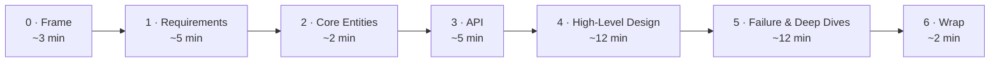

A repeatable structure is what keeps you from freezing or running out of time. You always know what to produce next, and you spend your minutes where they're scored. This is our playbook — the steps below, with a **bank-grade, failure-first** bias baked in.



For *how to behave* while you do this — driving the conversation, and naming every choice as **decision → rejected alternative → trade-off → failure mode** — see [The Principal Mindset](../mindset/). This page is the *what to produce* at each step.

## 0 · Frame it (~3 min)

Before any boxes, align on the problem and **write your assumptions on the board** so everyone designs against the same target:

> *~5k TPS peak · p99 < 300 ms on the sync path · RPO = 0 for the ledger · multi-tenant, regulated.*

Carry the [**bank lens**](../mindset/) into every step from here — under doubt you'll often choose to *refuse* rather than serve a possibly-wrong answer.

## 1 · Requirements (~5 min)

### Functional — "users should be able to…"
The core capabilities (*post a payment, view a statement, get notified*).

:::caution[Trap to avoid]
**Keep it targeted — prioritise the top ~3.** These problems have hundreds of possible features; identifying the few that matter is itself scored. A sprawling list hurts you.
:::

### Non-functional — "the system should…" (quantified)
*"Low latency"* is meaningless; *"feed < 200 ms at p99"* names the target. Run this checklist to surface the 3–5 that drive the design:

- **CAP** — consistency or availability under partition? → [Consistency](../../concepts/consistency/)
- **Scalability** — bursty traffic, read/write ratio? → [Scalability](../../concepts/scalability/)
- **Latency** — how fast, especially compute-heavy paths?
- **Durability** — how bad is data loss? (Ledger: none.)
- **Security & compliance** — access control, PCI/APRA. → [Security](../../concepts/security/) · [AU 2026](../../australia-2026/context/)
- **Fault tolerance** — redundancy, failover, recovery. → [Resilience](../../concepts/resilience/)
- **Environment** — mobile battery, limited memory/bandwidth?

### Capacity — only if it changes a decision
:::tip[Principal Move]
Skip back-of-envelope math that just concludes *"it's a lot."* **Do the arithmetic only when a number flips a choice** — e.g. estimating Top-K cardinality to decide single-node min-heap vs sharded. Otherwise say you'll estimate *when* it informs a design choice, and move on.
:::

## 2 · Core Entities (~2 min)

List the **nouns** your API exchanges and you persist — the data-model foundation (`User`, `Payment`, `Account`). Start with a small first draft and let it grow; you'll add fields once the design shows which state each request mutates. Prompts: *who are the actors? what resources satisfy the functional requirements?*

## 3 · API / Interface (~5 min)

Define the **contract** before internals — it maps closely to the functional requirements and guides the design. Default to **REST**; reach for **GraphQL** (diverse clients, avoid over-fetching) or **gRPC** (internal, performance-critical) only with a reason. Add **WebSockets/SSE** for real-time, but design the core API first.

```text
POST /v1/payments      body: { "amount": ..., "dest": ... }   (Idempotency-Key header)
GET  /v1/payments/{id} -> Payment
GET  /v1/statement     -> Entry[]
```

:::danger[Never]
**Derive the caller's identity from the auth token, never from the request body or path.** Trusting a `userId` from user input lets anyone act as anyone. Resources are plural nouns (`/payments`, not `/payment`). → [Security](../../concepts/security/)
:::

*Data-flow systems (ETL, pipelines): instead of an API, sketch the processing sequence — ingest → validate → transform → store → index.*

## 4 · High-Level Design (~12 min)

Boxes and arrows that satisfy the **API you just defined**. Reliable technique: go **endpoint by endpoint**, adding just enough components (services, datastores, caches, queues) to serve each. Narrate the data flow and what state changes per request; jot only the **design-relevant** fields next to each store.

:::caution[Trap to avoid]
**Don't gold-plate.** The most common failure is layering complexity too early and never reaching a complete solution. Build the simplest design that meets the **functional** requirements; defer caches, queues, and sharding to the deep dives where you harden against the **non-functional** ones. Spot a complexity opportunity? One-line verbal callout, then move on.
:::

## 5 · Failure modes & deep dives (~12 min)

Where principal candidates separate themselves — **lead this, don't wait to be probed.** Harden the design along two tracks:

**Failure-first (our bias).** For each risky component, walk the failure explicitly:
- What happens when this dependency **times out** (unknown outcome — reconcile, don't assume)?
- When this node **dies mid-operation** (durable/idempotent resume)?
- When a **partition** splits (CP refuse vs AP degrade)?
- How does it hold at **1× vs 100×** — what breaks first, what's the next move?

**Harden the NFRs.** Meet each non-functional requirement, address edge cases, and fix bottlenecks → [Resilience](../../concepts/resilience/) · [Load Shedding & Bottlenecks](../../deep-dives/load-shedding/) · [Idempotency](../../concepts/idempotency/).

:::caution[Trap to avoid]
**Don't talk over the interviewer.** Being proactive is good, but leave room for their probes — they have specific signals to collect, and monologuing both misses the cue and dents your communication score.
:::

## 6 · Wrap (~2 min)

Summarise the key trade-offs in a sentence each, then close with **reversibility** — the condition under which you'd revisit:

> *"Core ledger is CP — I'd rather refuse than be wrong. Saga over 2PC for scale, every step idempotent. I'd revisit sharding the ledger once write throughput nears the primary's ceiling."*

See the full [worked design](../../worked-design/money-movement/) for this framework applied end to end — happy path **and** failure path.
