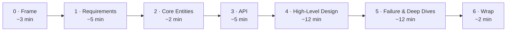

A repeatable structure keeps you from freezing or running out of time — you always know what to produce next, and you spend your minutes where the interviewer is actually grading you. This page is that structure. Each step below gives you **what to do** and a worked **example**. The bias throughout is **failure-first**: we always ask what happens when something breaks, the way a bank would.



This page covers *what to produce*. For *how to behave* while you do it — leading the conversation and explaining every choice as **decision → the alternative you rejected → the trade-off → how it can fail** — see [The Principal Mindset](../mindset/).

## 0 · Frame it (~3 min)

Agree on what you're building before you draw anything.

**Do this:**

- **Restate the question** in one sentence and check the interviewer agrees.
- **Ask 2–3 clarifying questions** that actually change the design (Who are the users? How much traffic? What is the one thing that must never break?).
- **Write your assumptions on the board** — expected traffic, how fast it must respond, how much data loss is acceptable, and how strict consistency must be — so everyone is designing against the same target.
- **State the rule you'll follow throughout** ([the bank lens](../mindset/)): when in doubt, the system should *refuse* rather than risk a wrong answer.

**Example — assumptions on the board:**

> *~5k <abbr title="Transactions Per Second — how many operations the system handles each second. '5k TPS peak' means up to 5,000 per second at the busiest time.">TPS</abbr> peak · <abbr title="99th-percentile latency — 99% of requests finish faster than this. It describes the slow-tail experience, not the average.">p99</abbr> &lt; 300 ms on the <abbr title="The synchronous path — the part of a request where the user is waiting for a response, so it must be fast (as opposed to background work done later).">sync path</abbr> · <abbr title="Recovery Point Objective — the maximum data loss you can tolerate, measured in time. RPO = 0 means lose zero committed transactions, even in a disaster.">RPO</abbr> = 0 for the ledger · <abbr title="Multi-tenant — one system serves many separate customers (tenants) while keeping each one's data isolated.">multi-tenant</abbr>, regulated.*

## 1 · Requirements (~5 min)

### Functional — "users should be able to…"

**Do this:**

- Write **2–3 concrete user actions** — describe actions (verbs), not features.
- **Confirm** with the interviewer that these are the flows you'll design for.
- **Park everything else** out loud as nice-to-have / out of scope.

**Example:**

- ✅ *"A user can send money to another user."*
- ✅ *"A user can view their transaction history."*
- 🅿️ Deferred: notifications, spending limits, statements export → "out of scope for today."

:::caution[Trap to avoid]
**List only the ~3 core features.** You're graded on finding the *few features that define the system* and designing them well — not on how many you can name. A long, unfocused list signals you can't prioritise, and it spreads your remaining ~40 minutes too thin to design anything properly. Narrowing the scope is the senior move, not a shortcut.
:::

### Non-functional — "the system should…"

Non-functional requirements (NFRs) are the *qualities* the system must have — how fast, how reliable, how secure — as opposed to *what* it does.

**Do this:**

- **Put a number on each one.** *"Low latency"* means nothing; *"the feed loads in under 200 ms for 99% of requests"* is a real target.
- **Pick the 3–5 that drive the design** from this checklist:

| Quality | Ask yourself | Goes deeper |
| --- | --- | --- |
| **<abbr title="CAP theorem — when the network between servers splits, a system can keep data Consistent OR stay Available, but not both. You choose which to favour.">CAP</abbr>** | In a network split, keep data correct (consistency) or keep serving requests (availability)? | [Consistency](../../concepts/consistency/) |
| **Scalability** | Bursty traffic? What's the read/write ratio? | [Scalability](../../concepts/scalability/) |
| **Latency** | How fast must it respond, especially on compute-heavy paths? | — |
| **Durability** | How bad is it to lose data? (Ledger: must lose none.) | — |
| **Security & compliance** | Who can access what? Any rules like <abbr title="PCI DSS — the security standard for handling payment card data.">PCI</abbr> / <abbr title="APRA — the Australian Prudential Regulation Authority, which regulates banks and insurers in Australia.">APRA</abbr>? | [Security](../../concepts/security/) · [AU 2026](../../australia-2026/context/) |
| **Fault tolerance** | Redundancy, failover, recovery — what happens when a part dies? | [Resilience](../../concepts/resilience/) |
| **Environment** | Mobile battery, limited memory/bandwidth? | — |

**Example:** *"<abbr title="Consistency + Partition-tolerance (CAP). Under a network partition the system favours correctness over staying available — it rejects writes it can't confirm rather than risk divergent data.">CP</abbr> on the money path (correctness > availability), <abbr title="99th-percentile latency — 99% of requests finish faster than this. It describes the slow-tail experience, not the average.">p99</abbr> &lt; 300 ms, <abbr title="Recovery Point Objective — the maximum data loss you can tolerate, measured in time. RPO = 0 means lose zero committed transactions, even in a disaster.">RPO</abbr> = 0, survive an <abbr title="Availability Zone — an isolated datacenter within a cloud region. 'Survive an AZ loss' means staying up even if one whole zone fails.">AZ</abbr> loss."*

### Capacity — only if it changes a decision

:::tip[Principal Move]
**It's good to have this judgement at principal level — but for a senior, you should at least** be able to do a quick estimate (traffic → storage / bandwidth) when the interviewer asks, and point to the one number that would actually change a design choice.

The principal-level move is knowing when *not* to bother:

- ❌ Adding up total storage just to say "that's big." → tells the interviewer nothing.
- ✅ Estimating how many items you must rank, to decide between **one machine and a sharded (split-across-machines) design.** → changes the design.

Otherwise, say "I'll estimate when a number informs a choice," and move on.
:::

## 2 · Core Entities (~2 min)

These are the main "things" your system works with — the data it saves in the database and sends back and forth over its API (a user, an account, a payment). Name them first, because everything else — the API, the schema, how you scale — is built around them.

**Do this:**

- **List the nouns** as a rough first draft (don't define database columns yet).
- **Keep it small** — let the list grow later, as the design shows which data each request changes.
- **Prompts to help:** *Who are the users/actors? What things (resources) do the features need?*

**Example — a payments system:**

- `User` — an account holder.
- `Account` — a balance the money moves between.
- `Payment` — one money-movement request, with a status.
- `LedgerEntry` — the debit/credit record, written once and never changed.

*(Fields come later — in the high-level design, once you see which request touches which entity.)*

## 3 · API / Interface (~5 min)

The **contract** between your system and the people or apps using it: the exact requests they can make and what they get back. Define this before any internal details — it follows directly from your functional requirements and guides the rest of the design.

**Do this:**

- **Pick a protocol** (the format for those requests — don't overthink it):
  - **REST** — simple request/response over HTTP; the default for most interviews.
  - **GraphQL** — when many different clients each need a different shape of data, so each one asks for exactly the fields it wants.
  - **gRPC** — fast service-to-service calls inside your own system.
- **One endpoint per functional requirement** — this becomes your design checklist in step 4.
- **Add a real-time channel** (WebSockets or SSE — ways to push live updates to the client) only if a feature needs it; design the core API first.

**Example:**

```text
POST /v1/payments         body: { "amount": ..., "dest": ... }   (Idempotency-Key header)
GET  /v1/payments/{id}  → Payment
GET  /v1/statement      → Entry[]
```

*(The `Idempotency-Key` header lets a client safely retry a payment without charging twice — see [Idempotency](../../concepts/idempotency/).)*

:::danger[Never]
**Derive the caller's identity from the auth token — never from the request body or path.** Trusting a `userId` from user input lets anyone act as anyone. Resources are plural nouns (`/payments`, not `/payment`). → [Security](../../concepts/security/)
:::

**Data-flow systems (ETL, pipelines):** instead of an API, sketch the processing sequence — *ingest → validate → transform → store → index.*

## 4 · High-Level Design (~12 min)

Draw the boxes and arrows — the components and how they connect — that deliver the **API you just defined**.

**Do this:**

- **Go endpoint by endpoint** — add just enough components (services, databases, caches, queues) to serve each one.
- **Talk through the data flow** out loud — what changes on each request, from start to response.
- **Note only the design-relevant fields** next to each database (not every column).

**Example — `POST /v1/payments`:**

> Client → API Gateway (handles authentication and rate-limiting) → Payment service → writes a `Payment(status=PENDING)` and a <abbr title="Double-entry bookkeeping — every movement is recorded as a matching debit and credit, so the accounts always balance.">double-entry</abbr> to the **Ledger (Postgres)** in one transaction → returns `202` (accepted) with the payment id.

:::caution[Trap to avoid]
**Don't over-build.** The most common failure is adding complexity too early and never finishing a complete solution. Build the simplest design that meets the **functional** requirements; leave caches, queues, and sharding for the deep dives, where you harden against the **non-functional** ones. Spot a chance to add complexity? Mention it in one sentence, then move on.
:::

## 5 · Failure modes & deep dives (~12 min)

This is where senior candidates stand out — **lead this part, don't wait to be asked.** Work two tracks:

**Track A — failure-first.** For each risky component, walk through how it fails:

- It **times out** — you don't know if it worked → reconcile (check the real result), don't assume it failed.
- It **crashes mid-operation** → keep the state saved (durable) so you can safely resume without redoing work (idempotent).
- The **network splits in two (a partition)** → either refuse writes to stay correct (CP), or keep serving with possibly-stale data (AP).
- At **1× vs 100× traffic** → what breaks first, and what's your next move?

**Track B — harden the NFRs.** Meet each non-functional requirement, handle the edge cases, and fix bottlenecks. → [Resilience](../../concepts/resilience/) · [Load Shedding & Bottlenecks](../../deep-dives/load-shedding/) · [Idempotency](../../concepts/idempotency/)

**Example:** *"The <abbr title="Payment Service Provider — the external company that actually moves the money, such as a card network, bank, or payment gateway.">PSP</abbr> call times out — I don't know if it succeeded. I keep the money on hold, check the real status by polling the provider, and the idempotency key means a retry can't double-charge."*

:::caution[Trap to avoid]
**Don't talk over the interviewer.** Being proactive is good, but leave room for their questions — they have specific things they need to see you handle, and talking nonstop both misses that cue and hurts your communication score.
:::

## 6 · Wrap (~2 min)

**Do this:**

- **Summarise the key trade-offs** — one sentence each.
- **End with reversibility** — say what would make you revisit each decision.

**Example:**

> *"The core ledger is CP — I'd rather refuse a write than record it wrong. I chose a <abbr title="Saga — a long operation split into small steps, each with an 'undo' (compensating) action, instead of one big locked transaction. It scales better across services.">Saga</abbr> over <abbr title="Two-phase commit — a protocol where all participants lock and commit together. Strong guarantees, but it doesn't scale well and stalls if one participant fails.">2PC</abbr> for scale, with every step idempotent. I'd reconsider splitting (sharding) the ledger once write traffic approaches what a single primary database can handle."*

See the full [worked design](../../worked-design/money-movement/) for this framework applied end to end — happy path **and** failure path.
