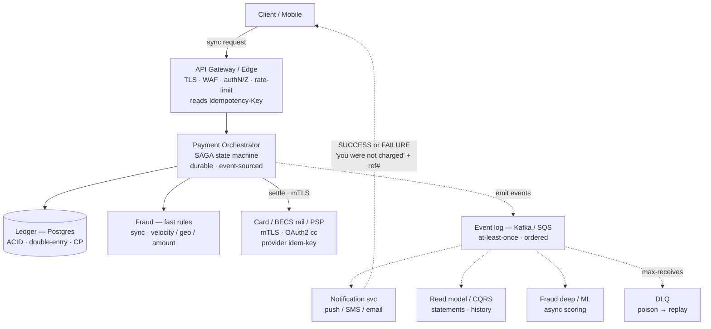
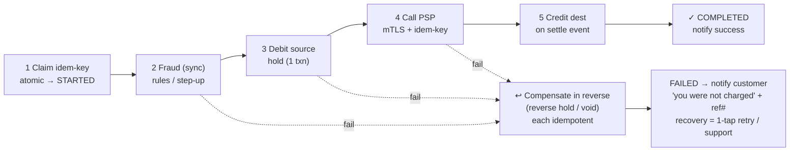

This is the whole manual applied to one problem. A principal answer covers the **happy path and the failure path with equal care** — and earns the trust of a bank.

## The brief & assumptions

State these on the board before drawing anything:

| Assumption | Value |
| --- | --- |
| Peak throughput | **~5,000 <abbr title="TPS — Transactions Per Second: operations handled each second at the busiest time.">TPS</abbr>** |
| Latency budget | **<abbr title="99th-percentile latency — 99% of requests finish faster than this.">p99</abbr> < 300 ms** on the sync path |
| Durability (ledger) | **<abbr title="RPO — Recovery Point Objective: the maximum data loss you can tolerate. RPO = 0 means lose nothing.">RPO</abbr> = 0** — lose no committed transaction |
| Recovery | **<abbr title="RTO — Recovery Time Objective: the maximum downtime you can tolerate before service is restored.">RTO</abbr> < 5 min** |
| Context | **Multi-tenant, regulated, fully auditable** |

## Architecture

Solid = synchronous request path · dashed = asynchronous events · the notification path is the **commonly-missed** one.

:::tip[Principal Move]
It's good to volunteer this unprompted at principal level — but for a senior, you should at least design the failure-notification path, not just the happy path. Point at the dashed `Notification → Client` edge and say it out loud: *"This is the commonly-missed path. Whether the payment succeeds **or fails**, the customer gets a notification with a reference."*
:::

## Saga + idempotency flow

Each step is **idempotent**; on any failure, **compensations run in reverse**, each itself idempotent.

### Duplicate request (same idem-key)

| State found | Response |
| --- | --- |
| `COMPLETED` | Return the **stored result** |
| `STARTED` (in-flight) | **409 Conflict** |
| Same key, **different body** | **422** |

## Failure modes → what I'd say

The heart of a principal answer. For each, the failure and the move:

:::caution[Walk these out loud]
- **PSP times out (unknown outcome).** Don't assume failed. **Reconcile** via a pull/status call; the idempotency key makes a retry safe; the **hold stays** until the outcome is resolved. Never double-spend on an ambiguous timeout.
- **Orchestrator dies mid-saga.** State is **durable / event-sourced**, so it **resumes on restart**; on replay, already-`COMPLETED` steps **no-op** because each is idempotent.
- **Ledger primary failover.** Brief write-unavailability; **queue & retry** the writes. **Never serve a balance from a replica for a debit** — read the truth from the primary.
- **Compensation itself fails.** Retry with backoff → **<abbr title="DLQ — Dead Letter Queue: where messages that keep failing are parked for inspection and replay, instead of blocking the queue behind them.">DLQ</abbr>** → alert + manual runbook. The ledger stays consistent and **never half-applied**.
- **Duplicate event** from at-least-once delivery. Consumer is **idempotent on the domain ID**, not the `MessageId`.
:::

## Customer comms — the gap

- Every request gets a **stable reference** + a **queryable status** (`RECEIVED → … → SETTLED / FAILED`).
- **Failure is notified as loudly as success** — *"not charged,"* with a clear next step.
- **Recovery** = idempotent retry / auto-reverse / support handoff carrying the reference.

## Say out loud

The three sentences that close the design:

:::note[Soundbites]
> *"The core ledger is **CP** — I'd rather refuse than be wrong; notifications and analytics are **AP**."*

> *"**Saga over 2PC** for scale; every step is idempotent and has a compensating action."*

> *"I'd **revisit sharding the ledger** once write throughput nears the primary's ceiling."*
:::

Each one names a decision, the trade-off, and (the last) the condition to revisit — the [principal mindset](../../start/mindset/) in one breath.
